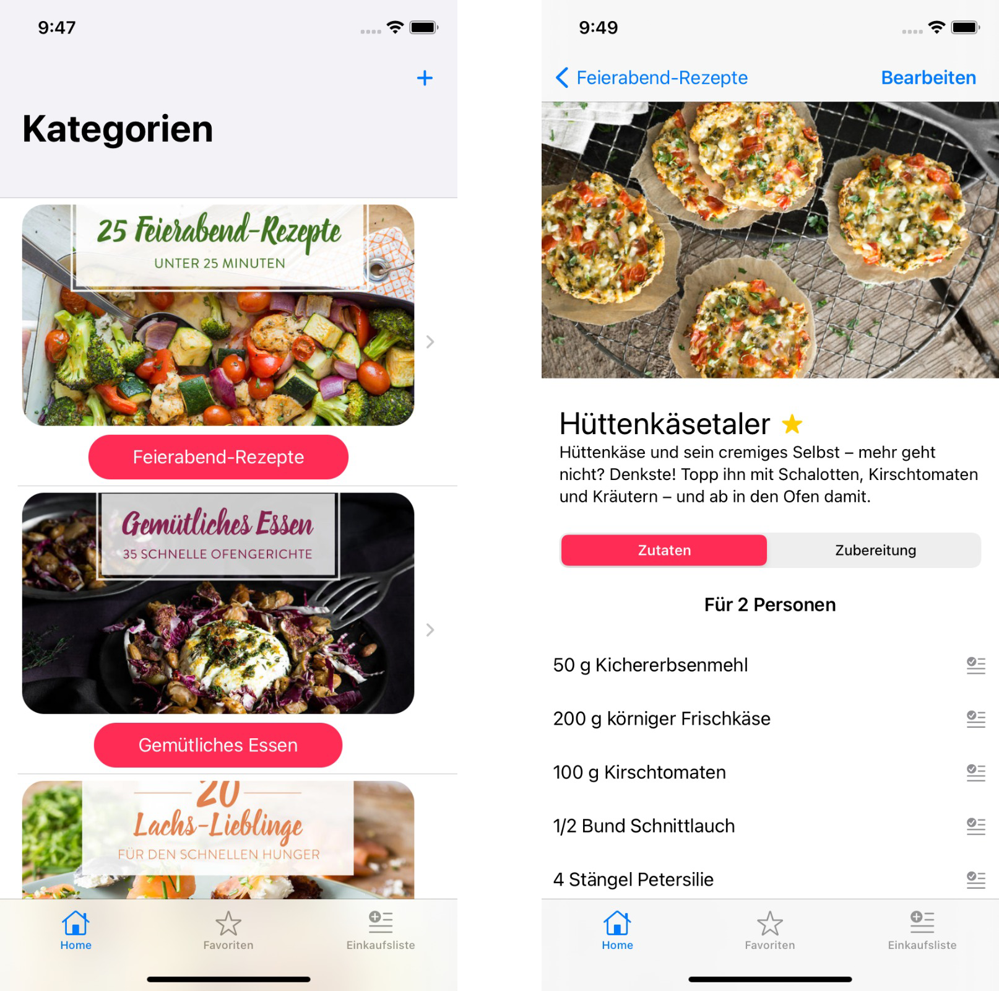

# CookMe

With this app you can create and manage your own recipe book. The recipes are divided into different categories to which you can add new recipes. Each recipe has a picture that the user can integrate via the camera, a list of ingredients and instructions for cooking. Ingredients can be added directly to the shopping list.

## Screenshots

  
